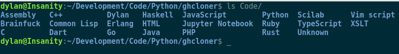

# Github Cloner

## What it does?

This python tool clones all your (own) repositories into a folder with the name of the main language
used in the repository. The language is detected by the github API, which just takes the main
language detected as 'repository language' as far as I know.

Example output:

## Why?

I like having my code checked out locally to browse through when I'm working on something so I can
use it as a reference. I could use the github website, but I like doing it locally.
It might be useful to some others so I'm putting it up here.

## How to run it

** I have only tested this on Linux (Debian specifically, but any Linux distro should do) **

Prerequisites:
    * Python3
    * PyGithub (pip install PyGithub)
    * Git cli tools [download instructions here](https://git-scm.com/book/en/v2/Getting-Started-Installing-Git)

Assuming the prerequisites are satisfied:

Clone this repository locally or download the python file through github. 
Or, copy the content, just get the python file locally. 

Now run: `python cloner.py`
(note: on some linux distributions, the default python is python2. run `python3 cloner.py` in this
case.)

It will prompt you to enter your username and password for github.

** Depending on the repositories and your local git setup, it might ask you to authenticate before cloning again! **

### What is "Unknown"?

If the language could not be detected, it will download them to a folder named "Unknown". This can
happen if you have empty repositories for example. 
